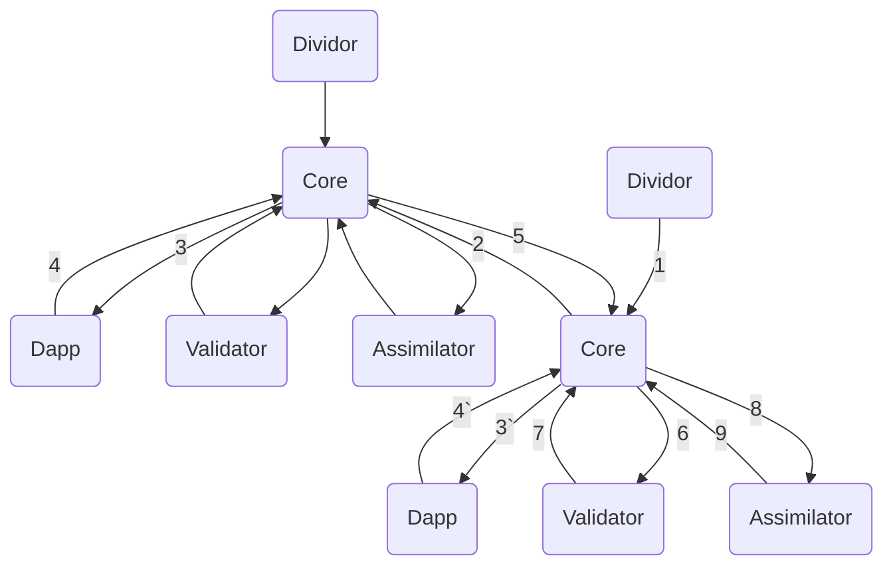

# CoT Network (Furseal) 算力分享系统生态应用开发手册
 2019.10.10

## 基础用语
### Work
由本地发起的计算请求称之为 **work**. **work** 可以是任何能用分布式架构处理的任务。**work**包含以下特征。

* **work**下的子任务（**block**）之间不存在时间先后顺序。
* **work**下的子任务（**block**）的结果之间不互相影响。

### Block
**work**的子任务称之为**block**

### CFPS (CoT Frames Per Second)

为了保证计算贡献的公正性，我们会在客户端运行一个benchmark，benchmark的运行结果是一个介于0到1之间的浮点数，我们称之为CFPS。CFPS用于直接的衡量机器的计算性能。

### CNC（Computing of things Network Coin）

算力分享系统中流通的唯一“货币”。算力需求方使用提供方提供的算力，需要使用CNC的形式来支付报酬给提供方。CNC是现实货币和计算力的中间桥梁。CNC以benchMark提供的计算性能参数(CFPS)为依据，从算力需求方划拨给算力提供方。单个block消耗的CNC计算方式为：

```
CNC=computeTime*CFPS*alpha
```
### appSet
appSet 是一套完成分布式运算的程序。它可以由任何一种语言开发，可以是脚本也可以是二进制可执行文件。
appSet由以下几部分组成:

名称			|执行位置		|功能
---			|---			|---
Dividor		|本地			|任务的拆分和配置
DApp		|本地或者远程	|具体执行计算任务
Validator		|本地			|验证任务各块的正确性等
Assimilator	|本地			|回收任务

各模块的具体信息请参考 模块
### appStore

appStore用于接收开发者发布的appSet，并将上传的appSet下发到具体参与计算的机器上面。

## 模块
### Core
**Core**为系统的核心模块，负责任务的调度，**P2P**通信和其他模块之间的协同。
### Dividor
负责具体的计算环境检测，比如需要确定本地是否安装了生成任务所需的三方软件，也需要要求其他参与分布式计算的机器所需的三方软件。若本地环境满足需求，**Dividor**将会通过**IPC**通信获取具体的任务信息，在本地将**Work**拆分为若干个**block**并上报到**Core**。
### DApp
**DApp**从**Core**中获取具体的计算请求，这个请求为上文的**block**。 **block**既可以是本地生成的，也可以是通过**P2P**网络接到的。**Dapp**接受到请求后，做实际的计算。计算完成后上报结果到**Core**。
### Validator
每个**block**计算完成，通过**P2P**网络返回到本地的时候，将会启动**Validator**来验证结果的有效性，若结果有效，将接收结果，若结果无效，对应的会重新发送当前的**block**。
### Assimilator
所有**block**计算完成后，将会启动**Assimilator**。**Assimilator**需要对所有已经验证的结果做合并，生成最终的结果。操作成功，即任务计算结束，若失败，则任务计算失败。

## 基本架构
### 工作流程



1.	任务拆分
1.  任务调度，分发
2.  执行任务，**3`**为本地执行
3.  任务执行完毕，上报到**Core**，**4`**为本地执行
4.  返回任务结果
5.  启动验证器验证任务
6.  返回验证结果
7.  启动回收器回收结果
8.  返回最终结果

### 通信
节点和节点之间的通信基于**P2P**网络。
模块之间的通信基于**IPC Channel**。地址定义遵循以下规则：

```
/tmp/app.[appSetName]_[moduleName]
```
如现有一个名字为**MyFirstAppSet**的应用，对应**validator**的**IPC**地址为：

```
/tmp/app.MyFirstAppset_validator
```

### 数据流通
数据流通指系统中涉及到的输入数据和输出数据的流通。

* 输入数据
需要计算处理的本地数据或者网络数据，**Core**会根据数据的类型来处理输入数据，如果数据为本地数据，**Core**会直接将其上传到P2P网络当中，如果数据为网络数据，**Core**会将其下载后，再上传到**P2P**网络中。

* 中间数据
计算中产生的数据原则上开发者不需要关心，只需要通过在**Dividor**中设定相应的硬盘空间要求来限定部分储存空间较小的机器，使其不能参与计算即可。每个**work**完结后，**Core**会通知每一个参与了计算的机器启动**GC**，删除所有中间数据，释放存储空间。

* 输出数据
输出数据会被**Assimilator**保存在本地，一定时间后，通过**GC**将其清除，具体的时间设定参考设置

## 数据定义

主要为**JSON**数据，我们按照系统的工作流程的顺序来介绍。

拆分流程为工作的第一个流程。在这个流程中，**Dividor**会准备好所有的输入数据，并规定拆分的数量和规则，生成一个称为**info**的**JSON**数据结构，并通过**IPC**管道将其发送到**Core**。
**info** 为**JSON**格式化的输入参数，定义**work**和**block**相关的信息，**Core**将解析**info**，按照其参数对任务做调度。
**Work**和**Block**共用同一套参数。参数结构如下：

```json
{
	workName:"testWork_abcdef123456789",
	protected:{
		inputFiles:[
			{
				fileName:"inputFile_xxx.zip",
				size:256,
				md5:"ef7a6b8c",
				url:"/Users/test/Desktop/123.zip",
				type:"public"
			},
			{
				fileName:"inputFile_xxx.zip",
				size:256,
				md5:"ef7a6b8c",
				url:"/Users/test/Desktop/343.zip",
				type:"private"
			},
			{
				fileName:"inputFile_xxx.zip",
				size:256,
				md5:"ef7a6b8c",
				url:"/Users/test/Desktop/888.zip",
				type:"private"
			},
			...
		],
		command:"-i inputFile_xxx.zip -c camera2 -o output.png"
	},
	unprotected:{
		target:[
			'darwin-x86_64',
			'windows-x86_64'
		],
		block:{
			number:64,
			indexes:8_8
		},
		appSet:"appSetExample",
		blockName:"testWork_abcdef123456789_0_0" //只有block含有此元素
	}
}
```


* **workName**

任务名称。要求全局唯一性，推荐使用**hash**或者随机数作为任务名称。

Value		|Default	|Recommend
----		|----	|----
string		|-		|YES

* **protected**

**protected** 记录任务相关的敏感信息。在任务发送之前，此部分将会被加密。

* **protected.inputFiles**

**protected.inputFiles** 为一个数组，每个元素为一个输入文件的各项信息。其中文件的各项信息定义如下：

Element		|Value				|Default	|Recommend
----		|----				|----	|----
fileName	|[string]				|-		|YES
url			|[string]					|-		|YES
size			|[integer]				|-		|NO
md5		|[integer]				|-		|NO
type			|'public','private'		|'public'|YES

* **protected.command**

Dapp 启动参数，以命令行形式传递给Dapp

* **unprotected**

**unprotected** 记录任务相关的非敏感信息

* **unprotected.block**

**unprotected.block** 记录**block**相关的共通信息。定义如下：

Element		|Value				|Default	|Recommend
----		|----				|----	|----
number		|[integer]			|-		|YES
indexs		|[integer]_[integer]	|-		|YES

**number** 为想拆分的总数，**indexs** 为拆分的方法，比如 **number** = 16 的情况下从两个维度拆分，每个维度4个**block**，这时的 **indexs** 为 4\_4, 如果是从三个维度拆分，第一，二维度 2 个，第三维度4个的情况下，这是的**indexs** 为 2\_2\_4，**indexs** 中数字的乘积应等于 **number**。

* **unprotected.appSet**

指定计算使用的appSet

* **unprotected.target**

指定计算任务支持的平台信息。参数为一个数组。目前支持的平台如下：

Value				|Default	|Recommend
----				|----	|----
[Array] 				|-		|YES
```
'darwin-x86_64','linux-amd64','linux-x86_64','windows-x86_64'
```

* **unprotected.blockName**

**block**名称，需要**Dividor**自动生成,格式为：

```
workName_[index 1]_[index 2]
```
其中 index 1，index 2 必须分别小于 **unprotected.block.indexs** 中对应的数字。

* **unprotected.index**

单个**block**对应的编号，格式：

```
 [index 1]_[index 2]
```
这里的 **[index 1]\_[index 2]** 和blockName中的 **[index 1]\_[index 2]**相同。


## API
所有的API均为**IPC Message**，**appSet**的各个模块需要运行一个**IPC Server**，模块启动后，**Core**会根据**appSet**的名称和模块名来和各个模块建立通信管道。具体参考通信。
通信的数据格式遵循（**Event,Data**）的形式，其中 **Event** 分为 **send** 和 **listen** 两种形式。 **send** 为发送给客户端（**Core**），**listen** 为 从客服端（**Core**）接收。
### Dividor API

Event	|Type	|Data
---		|---		|---
'request'	|send	|JOSN格式化的info

### DApp API

Event	|Type	|Data
---		|---		|---
'request'	|listen	|JOSN格式化的info
'result'	|send	|JOSN格式化的info

### Validator API

Event	|Type	|Data
---		|---		|---
'request'	|listen	|JOSN格式化的info
'result'	|send	|JOSN格式化的validate result数据

result 数据定义如下:

Element	|value
---		|---
result	|'YES' or 'NO'

例如： 

```json
{
	result: 'YES'
}
```

### Assimilator API

Event	|Type	|Data
---		|---		|---
'request'	|listen	|JOSN格式化的Assimilate 数据
'result'	|send	|JOSN格式化的Assimilate result数据

**Assimilate** 数据定义如下：

Element	|value
---		|---
result	|'YES' or 'NO'
workName|[string]
outputFilePath|[string]|
error		|any

```json
{
	workName:"testWorkName",
	outputFilePath:"/Users/test/Desktop/12345567.zip",
	result:"YES",
	error:""
}
```
**Assimilate result** 数据定义根据开发者自己定义，原则上来说返回数据中，error为空: `error == null || error == ''`，即为任务回收成功


## appSet开发实例

为了让开发者更好的，更快速的基于我们的算力分享系统开发出优秀的appSet，我们写了一个用于Autodesk Maya视频渲染的 [appSetExample](https://github.com/suutaku/appSetExample.git) 供大家参考。

## 发布appSet

开发者可以通过客户端上传appSet。点击应用商店界面的右上角的上传按钮即可开始上传。
按照提示填写必要信息，其中Dividor，Validator，Assimilator中的平台和硬件信息为本地环境的需求。DApp的平台和硬件的信息为远程机器的环境要求。

## 奖励

**appSet**发布到**appStore**后，一旦有人下载购买开发者开发的**appSet**，store将自动以扣除下载者的**CNC**，其中**95%**会转到开发者的账户中，其中**5%**转到我们的账户中，这部分CNC我们会用于维护**appStore**，**P2P Bootsrap**节点等基础设施的正常运营。

## 捐赠

如果您想捐助我们的项目，可以通过以下方式向我们捐款。

	|		|	|	|
---		|---		|---		|---	
微信支付	|支付宝	|BTC		|ETH

当您捐款后，请邮件我（JohnSuu@cotnetwork.com）或者留言以下内容。您的名字将会被保留在 backers 名单中。非常感谢您的支持！
[您的名字]\(您想要的链接\) ¥您的捐款额度

## 贡献

任何开发者或者组织都可以通过git，在license下来贡献或者使用这个项目。

## 联系方式

JohnSuu@cotnetwork.com


